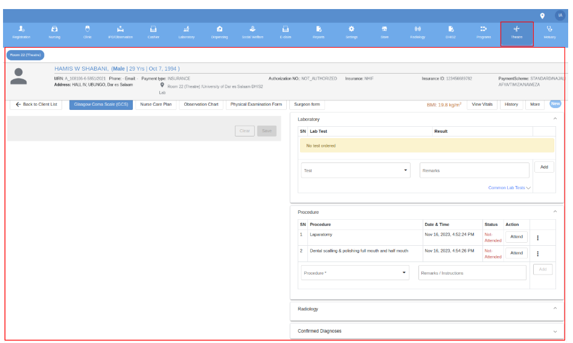

# Theater Module

The medical doctors and anesthesia specifically use this module to manage the patient during the operation procedures. There are four forms where a user documents for the patient before the operation is performed. These are the consent form, pre-operative, intraoperative, and postoperative forms. 

A doctor can provide the medications for the patient during the operations and those to be used after the operation. Also, in the theater module, anesthesia can document the required information before, during, and after the procedure operation. Finally, a nurse can document the observations after the procedure is completed.

